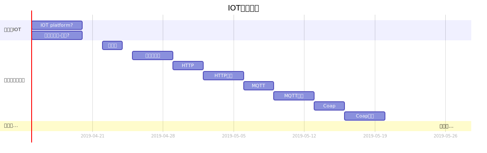

    

    
    
    

[📖English Documentation](README.md) | 📖 中文文档

 **:maple_leaf:高质量的 IOT 技术教程，代码主要源于国外开源物联网平台[ThingsBoard](https://thingsboard.io/)和对阿里云物联网平台的感悟**

### IOT

- [Mainstream Internet of Things platform features?](https://github.com/sanshengshui/IOT-Technical-Guide/wiki/Mainstream-Internet-of-Things-platform-features)

### :couple: 商业模式

- [ToB Blue Ocean's technical threshold - PaaS-SaaS]()

### :scroll: 概念

- [Thing Specification Language]()

### :email: 协议

-  [Coap](https://github.com/sanshengshui/IOT-Technical-Guide/wiki/TSL)
-  [MQTT ]()
-  [HTTP ]()
-  [Gateway]()

### :bar_chart: 物联网通用平台

- [RuleEngine]()
- [DB]()
- [RealTime]()

### :house: 架构

- [Msa]()

#### :closed_lock_with_key:  安全框架
- [Token]()
- [OAuth2.0]()

###  :wheel_of_dharma: 持续集成->持续部署->持续交付
>DevOps的本质其实是一种鼓励协作的文化
>Dev的工作是,为软件增加新功能和修复缺陷，这要通过频繁的变更来达到,Ops的工作是,保证系统的高稳定性和高性能，这代表着变更越少越不容易出错.
>DevOps是一组技术,包括自动化运维,持续交付,高频部署,Docker,Kubernates等

- [Docker]()
- [Kubernates]()

:honeybee::honeybee::honeybee::honeybee::honeybee::honeybee:

### Project Gantt

:four_leaf_clover::four_leaf_clover::four_leaf_clover::four_leaf_clover::four_leaf_clover::four_leaf_clover::four_leaf_clover:

### 版权说明

- ✍️ [穆书伟 (sanshengshui@github)](https://github.com/sanshengshui)
- 除非另行注明，这个项目中的所有内容采用Apache2.0（[Apache-2.0](http://www.apache.org/licenses/LICENSE-2.0)）协议共享。
- 不少文章在原基础上翻译或演绎而来，页面上方标注了原作者、原文链接以及原文采用的协议。如有版权疑问，请在 Issue 中提出。
- 如果引用本此项目教程代码或者文章,请注明作者和github项目地址。
- 欢迎通过 Issue 或者 Pull Request 推荐你认为合适的资料，让这份菜单更充实一些。

:four_leaf_clover::four_leaf_clover::four_leaf_clover::four_leaf_clover::four_leaf_clover::four_leaf_clover::four_leaf_clover:

### 为什么要做这份菜单

> 在学习开源物联网平台ThingsBoard和使用阿里云物联网平台的时候，让我对物联网这个领域产生了极大的兴趣。我发现ThingsBoard的更新速度十分频繁且代码架构十分优秀，随着未来十年内将会有数十亿的设备将联网和国内对物联网领域的高热度。众多的开发人员经历过Web2.0和移动互联网的时代，但是对于未来的设备联网这块的知识十分缺乏，并且搜索引擎上大多数文章都比较的粗浅。此外，这些资料往往只涉及某些特定的话题，如果能有一份菜单将这些菜谱以特定的方式串起来，那么对于 IOT 学习者来说将会是极大的便利。尤其对于我这样热爱查阅社区资料胜过出版物的懒人:new_moon_with_face: 随着我的学习节奏还会不断有新的菜谱加入进来。
>
