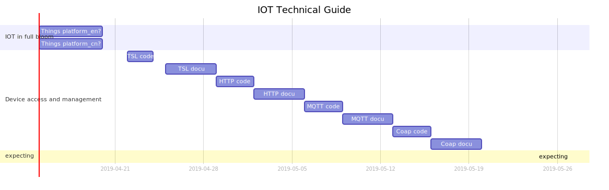

    

    
    
    

📖 English Documentation | [📖 中文文档](README.md)

 **:maple_leaf:High quality IOT technology tutoria,The code is mainly derived from the foreign open source Internet of Things platform [ThingsBoard](https://thingsboard.io/)  and the perception of the Alibaba Cloud IoT platform.**

### IOT

- [Mainstream Internet of Things platform features?](https://github.com/sanshengshui/IOT-Technical-Guide/wiki/Mainstream-Internet-of-Things-platform-features)

### :couple: business model

- [ToB Blue Ocean's technical threshold - PaaS-SaaS]()

### :scroll: concept

- [Thing Specification Language]()

### :email: Protocol

- 

  Protocol :  [CoAP](https://coap.technology/)

  Framework: [Californium(cf)](https://www.eclipse.org/californium/)
  
  Tutorials: IOT-Guide-Coap

- 

   Protocol :  [MQTT](http://mqtt.org/)
  
   Framework:  [Netty](https://netty.io/)
   
   Tutorials: IOT-Guide-MQTT

- 
  
   Protocol :  [HTTP](https://en.wikipedia.org/wiki/Hypertext_Transfer_Protocol)
   
   Framework:  [Spring Boot](https://spring.io/projects/spring-boot)
       
   Tutorials: IOT-Guide-HTTP
   
- 
  
    Explanation: Gateway
    
    Tutorials: IOT-Guide_Gateway

### :bar_chart: universal function

- [RuleEngine]()
1. [Forward-Chaining Engines](https://dzone.com/articles/a-guide-to-rules-engines-for-iot-forward-chaining)
  
  2. [Stream Processing Engines](https://dzone.com/articles/a-guide-to-rules-engines-for-iot-stream-processing)
  
  3. [Condition-Action Engines](https://dzone.com/articles/a-guide-to-rules-engines-for-iot-condition-action)
  
  4. [Decision Trees](https://dzone.com/articles/a-guide-to-rules-engines-for-iot-decision-trees)
  
  5. [CEP Engines](https://dzone.com/articles/a-guide-to-rules-engines-for-iot-cep-engines)
  
  6. [Finite State Engines](https://dzone.com/articles/a-guide-to-rules-engines-for-iot-finite-state-mach)
  
- [DB]() 

- [RealTime]() 

### :house: Architecture

- [Msa]()
  
  1. Service Discovery and Configuration
  
     **Eureka** 
  
     **Consul** 
  
  2. Gateway Service
  
     **Zuul** 
  
  3. Config management
  
     **Apollo** 
  
  4. monitoring
  
     **CAT** 
     
     **SkyWalking** 
  
  5. Fault Tolerance
  
     **Hystrix** 
  
  6. Alerting
  
     **Prometheus** 
  
     

#### :closed_lock_with_key:  security framework
- [Token]()

- [OAuth2.0]()

###  :wheel_of_dharma: DevOps
- [Docker]()

- [Kubernates]()

### :label: Serverless

- 

-  OpenFaaS 

:honeybee::honeybee::honeybee::honeybee::honeybee::honeybee:

### Project Gantt

:four_leaf_clover::four_leaf_clover::four_leaf_clover::four_leaf_clover::four_leaf_clover::four_leaf_clover::four_leaf_clover:

### Copyright 

- ✍️ [james mu (sanshengshui@github)](https://github.com/sanshengshui)
- Unless otherwise noted, all content in this project is shared using the Apache 2.0 ([Apache-2.0](http://www.apache.org/licenses/LICENSE-2.0)) protocol.
- Many articles were translated or interpreted on the original basis. The original author, the original link and the agreement adopted by the original text were marked on the top of the page. If you have a copyright question, please ask in the Issue。
- If you quote this tutorial code or article, please indicate the author and github project address。
- Welcome to recommend the information you think is appropriate through Issue or Pull Request, and make this menu more fulfilling.

:four_leaf_clover::four_leaf_clover::four_leaf_clover::four_leaf_clover::four_leaf_clover::four_leaf_clover::four_leaf_clover:

### Why do you want this menu?

> When I learned about the open source IoT platform ThingsBoard and the Alibaba Cloud IoT platform, I was very interested in the field of Internet of Things.
>
>  I found that the implementation speed of the ThingsBoard is very frequent and the code architecture is very good. With the next ten years, there will be billions of devices that will be connected to the Internet and domestically. Numerous developers have experienced the era of Web 2.0 and mobile Internet, but the knowledge of future device networking is very scarce, and most articles on search engines are relatively shallow. In addition, these materials often only cover certain topics.
>
>  If a menu can be used to string these recipes in a specific way, it will be a great convenience for IOT learners. Especially for lazy people like me who love to view community information better than publications:new_moon_with_face: As my learning rhythm continues, new recipes will continue to be added.

